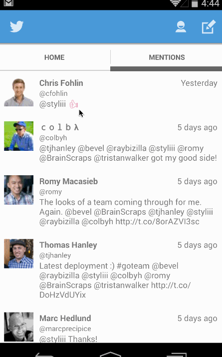

# Simple Twitter Client
Android app that allows you to view timeline and send tweets.

## Overview
Completed User Stories
- [x] User can sign in to Twitter using OAuth login
- [x] User can view the tweets from their home timeline
- [x] User should be displayed the username, name, and body for each tweet
- [x] User should be displayed the relative timestamp for each tweet "8m", "7h"
- [x] User can view more tweets as they scroll with infinite pagination
- [x] User can compose a new tweet
- [x] User can click a “Compose” icon in the Action Bar on the top right
- [x] User can then enter a new tweet and post this to twitter
- [x] User is taken back to home timeline with new tweet visible in timeline
- [x] Tweets are persisted into sqlite and can be displayed from the local DB
- [x] Advanced: User can refresh tweets timeline by pulling down to refresh (i.e pull-to-refresh)
- [x] Advanced: Improve the user interface and theme the app to feel "twitter branded"

- [x] User can switch between Timeline and Mention views using tabs.
  - [x] User can view their home timeline tweets.
  - [x] User can view the recent mentions of their username. 
- [x] User can navigate to view their own profile
  - [x] User can see picture, tagline, # of followers, # of following, and tweets on their profile. 
- [x] User can click on the profile image in any tweet to see another user's profile.
  - [x] User can see picture, tagline, # of followers, # of following, and tweets of clicked user.
  - [x] Profile view should include that user's timeline
- [x] User can infinitely paginate any of these timelines (home, mentions, user) by scrolling to the bottom  
- [x] Advanced: When a network request is sent, user sees an indeterminate progress indicator

Time Spent: 7 hours (1st week), 10 hrs (2nd week)

## Walkthrough

